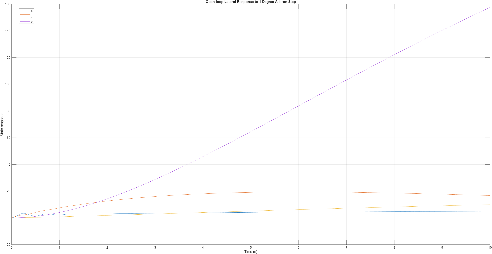
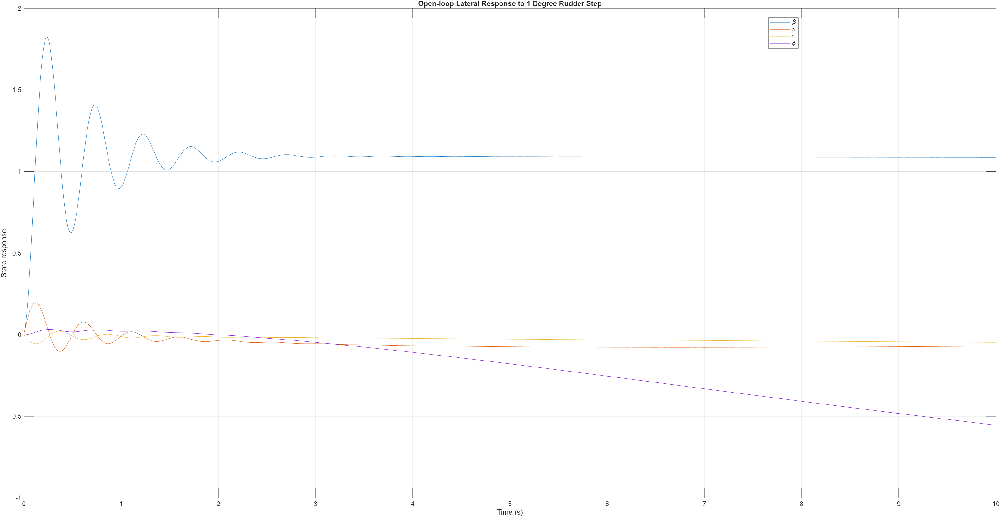

Q2 - Determine the following:
    a.  The open-loop response of the aircraft to a 1% step in thrust (this is a step change) of 1% of the maximum thrust).
    b.  The open-loop response of the aircraft to a 1° step in elevator position.
    c.  The open-loop response of the aircraft to a 1° step in aileron position.
    d.  The open-loop response of the aircraft to a 1° step in rudder position.
Include a description of the responses that you observe. Identify the short-period, phugoid, roll subsidence, spiral and Dutch roll modes. Without a controller, would you consider these responses to be acceptable?

Q2 Solution:
The longitudinal and lateral directions each have the linearised, decoupled state space models shown in the solution to Q1.
The concise longitudinal/lateral aerodynamic stability and control derivatives, shown in tables A2.5, A26, A2.7 and A2.8 of the provided document are used to convert the provided aircraft and trim point specifications to match the values required to form the numerical state space models. These calculations can be seen in the MATLAB script shown in Appendix A {name it whatever you like}. These are then used to form state space models. These models are inspected to find poles. Both models have no zeros.

Longitudinal Poles:
$-0.3035+0j$
$0.965 \pm 0.1020j$
$-0.3+0j$

Lateral Poles:
$-1.7188\pm12.7294j$
$-0.1346+0j$
$-0.2009+0j$

From these pole locations we can expect that the longitudinal model will be unstable due to the poles on the RHS of the s-plane. The lateral model may be stable, however slow moving due to the poles close to the Imaginary axis.  
a.

Figure 1 shows the open-loop longitudinal response to a 1% step in thrust. This shows an unstable response, with large growth in the states $w$ and $u$, which represent motion in the x and z directions. The response is not quickly damped and does not return to equilibrium.
The phugoid mode is the low-frequency longitudinal mode, involving an exchange between forward speed, vertical motion and pitch over a long time scale. The plot shows very slow change over tens of seconds, which can represent the phugoid mode. The large growth of the states suggests the phugoid is lightly damped or unstable in the open-loop. The short-period mode is either weakly exited by the thrust input, or masked by the slow phugoid behaviour. This is because there are no obvious fast oscillation in the plot.
This is not an acceptable response to thrust input alone. The long term divergence would not be acceptable without control. 
b.

The elevator step response, shown in Figure 2, is much more dramatic than the thrust response. The very large growth in states $u$ and $q$ and drift in $\theta$ is a clear sign of open-loop longitudinal instability. 
The rapid change in pitch rate is associated with the short-period dynamics, while the longer drift in speed and pitch angle show the phugoid behaviour. This response is unacceptable without control as a small elevator step produces very large state excursions, showing that pitch attitude cannot be maintained without feedback control.
c.

The aileron step response shows a quick growth then decay in $p$, $r$ and $\beta$ growing slowly and $\phi$ increasing and settling at a very large bank angle instead of returning to zero. This response shows the roll subsidence mode, through the fast response in roll rate $p$ and the spiral mode, through the long term drift in bank angle $\phi$. The roll subsidence mode is a fast, overdamped response which matches the roll rate response. As $\phi$ does not return to zero and instead grows to a large value, the spiral mode appears to be unstable. 
A step in the aileron position causes the aircraft to move into a large sustained bank angle. This is not an acceptable open-loop response. 
d.

The rudder step response shows short oscillator transients in $\beta$, $p$ and $r$. This is the dutch roll mode. The oscillation decays quickly so the dutch mode appears to be stable and damped. The decay of roll rate $p$ is the roll subsidence mode. The slow drift of bank angle $\phi$ to a non-zero value shows the spiral mode. Again, as $\phi$ does not return to zero this shows the spiral mode is unstable. The long term spiral drift makes the open loop response unacceptable.

Analysis confirms the longitudinal model is unstable, as expected from the pole locations. This is unacceptable for an open-loop system. The lateral mode response is still not acceptable in open-loop due to spiral mode drift.

# Appendix (number these however you like, i will start with A to refer to them in my text)
# Appendix A - Q2 solution
```matlab


```

