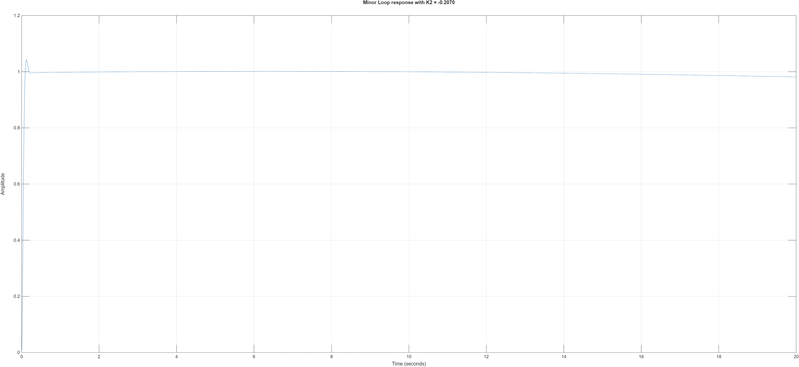

Q4 - Use the major and minor loop design techniques to design a pitch attitude hold control
system.

Q4 Solution:
Pitch Attitude Hold control is used to improve both short-period and phugoid stability. The figure below shows one standard approach to direct pitch control, measuring both pitch rate $Q$ and pitch angle $\theta$. Major and Minor loop design is used to maintain both the short-period and phugoid stability. Rate Gyro and Attitude Gyro are assumed to be 1 for this task. 

The block $\dfrac{b}{s+b}$ accounts for the actuator time delay, modelled as a first order lag block with the transfer function $\dfrac{1}{1+s\tau}$ with time constant $\tau=0.02s$. This block can also include the saturation block, however as this system is linearised around an operating point it can be assumed that the system can not saturate. The block $\dfrac{Q(s)}{\delta_E(s)}$ represents the relationship between $\delta_E$ and $q$, which can be found using the longitudinal state space model with the $\underline{B}$ matrix using only the column corresponding to $\delta_E$ and the $\underline{C}$ matrix set to $\begin{bmatrix}0&0&1&0\end{bmatrix}$ to only pass $q$ as the output. The combined minor open-loop transfer function can be written as $L_2(s)=\dfrac{1}{1+s\tau}\dfrac{Q(s)}{\delta_E(s)}=\dfrac{N_2(s)}{D_2(s)}$. The closed-loop characteristic equation becomes $D_2(s)+K_2N_2(s)=0$, using negative feedback sign convention. A desired damping ratio of $\zeta=0.7$ was selected to provide a well damped response with limited oscillation. This is used to choose a desired complex pole pair, $s_d=-\zeta\omega_n\pm j\omega_n\sqrt{1-\zeta^2}$. $\omega_n$ is chosen using the relationship $\text{Im}\left(-\dfrac{D_2(s_d)}{N_2(s_d)}\right)=0$ to ensure the resulting controller gain $K_2$ was real. The resulting minor-loop gain was $K_2=-0.207$. It is important to note the sign of $K_2$ can instead be positive if positive feedback is used, however a negative gain will work here instead. This corresponds to the designed short-period poles being placed at $-25.05\pm j25.55$. This gives a stable and well damped minor loop pitch-rate response, shown in Figure {whatever number}. The lightly damped, slower phugoid response remained as seen by the slow decay from $1$. This is to be shaped by the lower major loop.

With the minor loop fixed, the major loop was formed from pitch-angle path and closed minor loop. The plant for the major loop was,
$G_{\theta,in}(s)=\dfrac{G_a(s)G_\theta(s)}{1+K_2G_a(s)G_q(s)}$
where $G_a(s)$ is the minor loop actuator lag block, $G_q(s)=\dfrac{q(s)}{\delta_E(s)}$ and $G_{\theta}(s)=\dfrac{\theta(s)}{\delta_E(s)}$.

The same design steps used for the minor loop is used here, with damping ratio $\zeta=0.6$ to achieve the best compromise between speed and overshoot. Lower values such as $\zeta=0.5$ produced a more oscillatory response and higher values like $\zeta=0.7$ led to a near zero gain due to overlapping poles. The resulting major loop gain with $\zeta=0.6$ is $K_1=-2.0827$. This results in dominant outer-loop poles at $-15.84\pm j21.12$. This produced a closed loop system with step response info as following:
$t_r=0.1177s$
$T_p=0.2440s$
$\%OS=0.55\%$
$T_s=0.1955s$
$e_{\text{steady state}}=3\times10^{-6}\:\text{rad}$

As an example of system performance a sinusoidal reference can be used. This produces the output seen in Figure {whatever}. The output is able to track the magnitude but has a small phase shift. This response can be expected due to the nature of the actuator, with the $0.02s$ delay causing the visible phase shift.

Overall, this is an acceptable response. The controller can be seen to track an input reference accurately, with negligible stead-state error and very little overshoot. The short-period and phugoid response are now well damped and stable as seen in the closed-loop step response. This shows the chosen major and minor loop gains provide effective Pitch Attitude Hold control.` 

