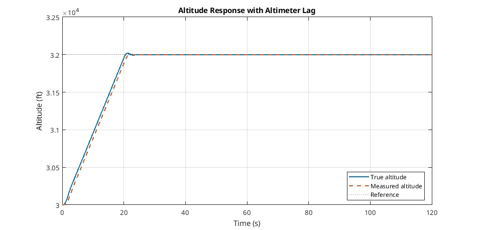
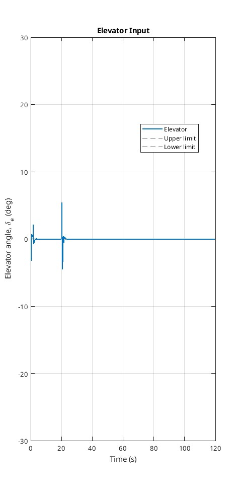
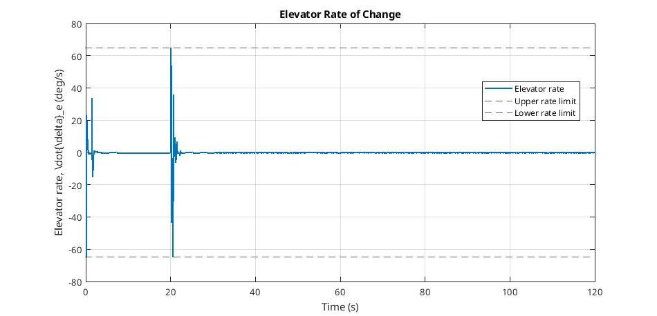
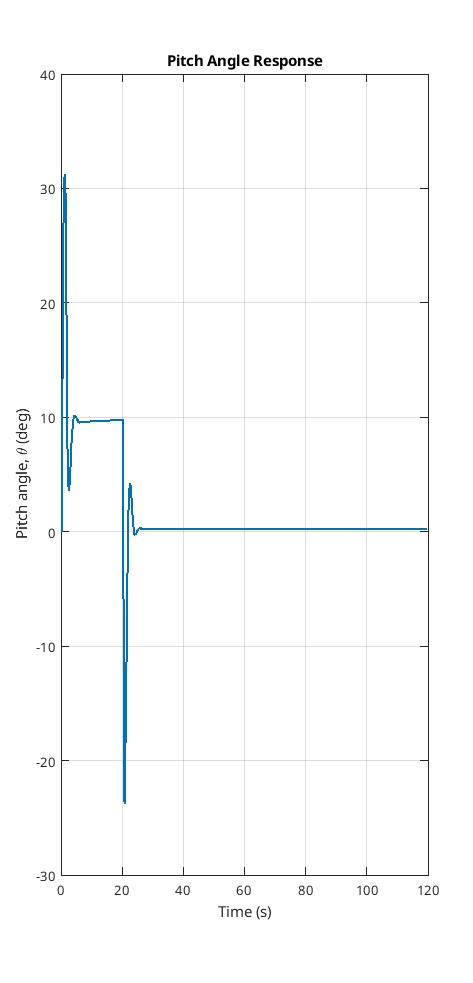
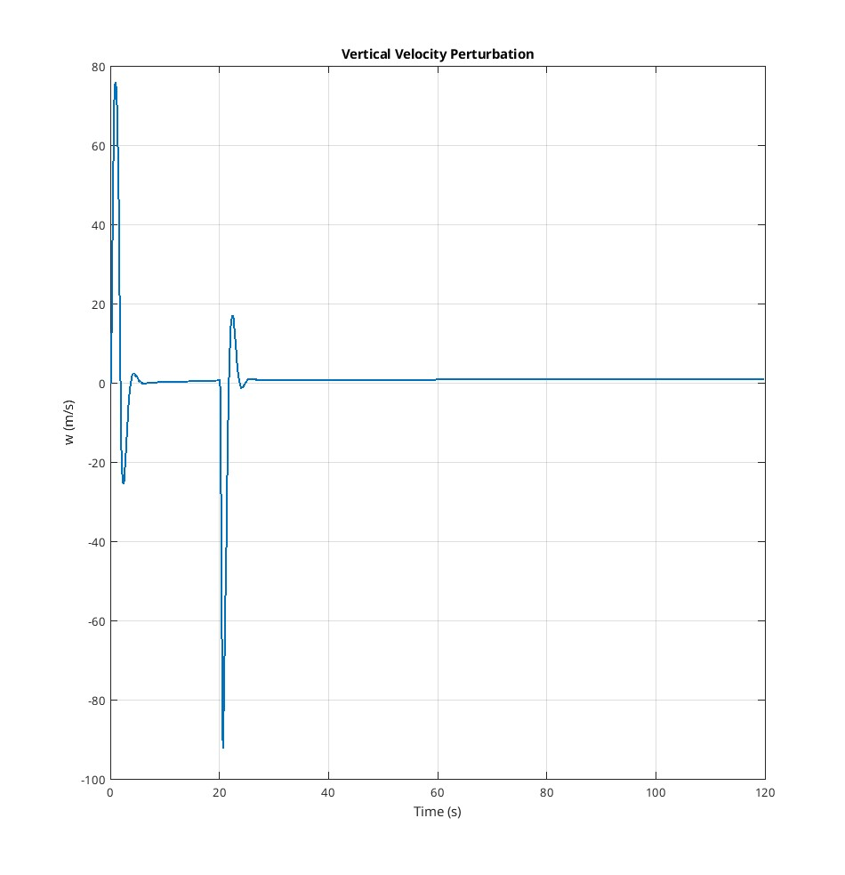

# Q7
Implement a model predictive control system to execute an altitude-adjustment-and- hold command, taking the plane from its starting altitude of 30 000 ft and ending at an altitude of 32 000 ft. Note that in practice, the trim state changes here, but the linearised dynamics still provide a reasonable model of the system. As part of your response, show that the transfer function between the elevator angle and altitude is given approximately by,
$$\dfrac{h(s)}{\delta_e(s)}=\dfrac{V_0}{s}\left(\dfrac{\theta(s)}{\delta_e(s)}-\dfrac{\alpha(s)}{\delta_e(s)}\right)$$
 
# Solution
## System Model
First the longitudinal system model was formed,
$$\dot{x}=\underline{A}\underline{x}+\underline{B}\underline{u}$$
$$
\begin{bmatrix}\dot{u}\\\dot{w}\\\dot{q}\\\dot{\theta}\end{bmatrix}=
\begin{bmatrix}-0.0002 & 0.0013 & -15.8623 & -9.7727 \\ -0.0148 & -0.0490 & 181.3074 & -0.8550 \\ 0.0005 & 0.0003 & -0.0913 & -0.0004 \\ 0.0000 & 0.0000 & 1.0000 & 0.0000 \end{bmatrix}
\begin{bmatrix}u\\w\\q\\\theta\end{bmatrix} +
\begin{bmatrix}83.4038 & 97.5694 \\ 537.5876 & 0.0000 \\ -123.2522 & 0.0000 \\ 0.0000 & 0.0000\end{bmatrix} 
\begin{bmatrix}\delta_e \\ \delta_t \end{bmatrix}
$$

$$\underline{y}=\underline{C}\underline{x}$$
$$
\underline{y} = \begin{bmatrix}1&0&0&0\\0&1&0&0\\0&0&1&0\\0&0&0&1\end{bmatrix}
\begin{bmatrix}u\\w\\q\\\theta\end{bmatrix}
$$

## Discrete System
Next the discrete state space models were formed using the fomrulas below with $T_s=0.5$,
$$\underline{A}(T_s)=\underline{A}_m=e^{\underline{A}T_s}=I+\underline{A}T_s+\dfrac{\underline{A}^2T_s^2}{2!}+...+\dfrac{\underline{A}^kT_s^k}{k!}$$
$$\underline{B}(T_s)=\underline{B}_m=\left(IT_s+\dfrac{\underline{A}T_s^2}{2!}+\dfrac{\underline{A}^2T_s^3}{3!}+...+\dfrac{\underline{A}^kT_s^{k_1}}{(k+1)!}\right)\underline{B}$$
$$\underline{C}(T_s)=\underline{C}$$

The first column of $B_m$ is taken to only use the elevator control input $\delta_e$.

## Augmented Plant Model 
This is then augmented to add altitude and altimeter lag states forming the following plant model,
This is required because the original plant model did not originally include altitude, however this is needed to accuratley control the height response. The altimeter state is used becuase the controller does not have perfect knowledge of the current height, only the delayed measurment from the altimeter.  

The height state is formed from the aircraft dynamics, using the flight path angle. The climb rate is approximatley,
$$\dot{h}=V_0\gamma$$
Substituting $\gamma = \theta-\alpha$. For small pertubations the angle of attack is approximatley 
$$\alpha\approx \dfrac{\omega}{V_0}$$
This gives,
$$\dot{h}=V_0\theta-\omega$$
This is also equivalent to,
$$\dfrac{h(s)}{\delta_e(s)}=\dfrac{V_0}{s}\left(\dfrac{\theta(s)}{\delta_e(s)}-\dfrac{\alpha(s)}{\delta_e(s)}\right)$$

This can be discretised to form,
$$h[k+1]=h[k]+T_s(V_0\theta[k]-\omega[k])$$

The measured height state can be formed following the steps below,
$$\dfrac{h_m(s)}{h(s)}=\dfrac{a}{s+a}$$
$$\dot{h_m}=a(h-h_m)$$
where,
$$a=\dfrac{1}{\tau_{alt}}$$
Discretising gives,
$$h_m[k+1]=T_sah[k]+(1-T_sa)h_m[k]$$

Thsese are both used to form the augmented plant model below,
$$
\begin{bmatrix}u[k+1]\\w[k+1]\\q[k+1]\\\theta[k+1]\\h[k+1]\\h_m[k+1]\end{bmatrix} = 
\begin{bmatrix}-0.0002&0.0013&-15.8623&-9.7727&0.0000&0.0000\\-0.0148 &-0.0490&181.3074&-0.8550&0.0000&0.0000\\0.0005&0.0003&-0.0913&-0.0004&0.0000&0.0000\\0.0000 &0.0000 &1.0000&0.0000&0.0000&0.0000\\
0.0000&-0.5000&0.0000&9.1000&1.0000&0.0000\\0.0000&0.0000&0.0000&0.0000&0.0625&0.9375\end{bmatrix}
\begin{bmatrix}u[k]\\w[k]\\q[k]\\\theta[k]\\h[k]\\h_m[k]\end{bmatrix} + 
\begin{bmatrix}6.6356&0\\-1.0966&0\\-6.1484&0\\-0.1538&0\\0&0\\0&0\end{bmatrix}
\begin{bmatrix}\delta_e\\\delta_T\end{bmatrix}
$$
$$
y[k+1]=\begin{bmatrix}0&0&0&0&0&1\end{bmatrix}\begin{bmatrix}u[k]\\w[k]\\q[k]\\\theta[k]\\h[k]\\h_m[k]\end{bmatrix}
$$
$C_m$ only includes the altimeter state because the controller is using the measured altitude.

## MPC Augmentation
The MPC augmentation is formed using the following steps,
$$x[k]=\begin{bmatrix}\Delta x_m[k]\\y[k]\end{bmatrix}$$
$$\Delta x_m[k+1]=\underline{x}_m[k+1]-\underline{x}_m[k]$$
$$\Delta u[k+1]=\underline{u}_m[k+1]-\underline{u}_m[k]$$

$$\underline{x}[k+1]=\begin{bmatrix}\underline{A_m}&\underline{0}\\\underline{C}_m\underline{A}_m&1\end{bmatrix}\underline{x}[k]+\begin{bmatrix}\underline{B}_m\\\underline{C}_m\underline{B}_m\end{bmatrix}\Delta u[k]$$
$$y[k]=\begin{bmatrix}\underline{0}&1\end{bmatrix}\underline{x}[k]$$

The MPC predicts the future output over a prediction horizon using,
$$\underline{Y}=\underline{F}x[k_i]+\underline{\Phi}\underline{\Delta U}$$

The free response matrix $\underline{F}$ and free response matrix $\underline{\Phi}$ can be pre-calculated as seen below to simplify calculations,
$$\underline{F}=\begin{bmatrix}\underline{CA}\\\underline{CA}^2\\...\\\underline{CA}^{N_p}\end{bmatrix}$$
$$
\underline{\Phi}=\begin{bmatrix}\underline{CB}&\underline{0}&\underline{0}&...&\underline{0}\\
\underline{CAB}&\underline{CB}&\underline{0}&...&\underline{0}\\
...&...&...&...&...\\
\underline{CA}^{(N_p-1)}\underline{B}&\underline{CA}^{(N_p-2)}\underline{B}&\underline{CA}^{(N_p-3)}\underline{B}&...&\underline{CA}^{(N_p-N_c)}\underline{B}\end{bmatrix}
$$

## Reference Command
The altitude command used is from 30,000 ft to 32,000 ft. As the model is based on perturbations around the trim altitude so the reference used by the MPC is $r=609.6m$. An initial step command caused a very aggressive pitch angle and vertical velocity responses. This occurred because the controller was trying to reach the final altitude as quickly as possible, which pushed the linear model outside its realistic small perturbation range.
To improve the response a ramped reference was used instead. This was implemented as,
$$r_{now}=min\left(r,\dfrac{r\cdot t_{now})}{\text{climb time}}\right)$$
The predicted reference vector is then set as $R_s=r_{now}$ over the predicted horizon. This is updated in the main simulation loop, with climb time as a tunable parameter. This helped to reduce the large pitch angle and vertical velocity transients seen initially.

## Cost Function
The MPC cost function was used to to balance the altitude tracking performance against elevator movement. The cost function used is,
$$J=(\underline{R}_s-\underline{Y})^T(\underline{R}_s-\underline{Y})+\underline{\Delta U}^T R\underline{\Delta U}$$
The first term penalises the predicted altitude tracking error. The second term penalises changes in elevator input. The input weighting $R$ is a tunable parameter. Increasing $R$ made the response smoother, however if it was to large the aircraft became slow to reach the target altitude.

## Elevator Constraints
The MPC included hard constraints on elevator deflection and elevator rate. The specification defines constraints,
$$-30^\circ\le\delta_e\le30^\circ$$
$$|\Delta\delta_e|\le65^\circ/s\cdot T_s$$

## Simulation Method
The simulation was performed by repeatedly solving the MPC optimisation problem at each time step. At each sample, the measured altitude was calculated from the plant state. The change in plant state was then used to form the augmented MPC state. The quadratic programming problem was then solved to find the optimal sequence of future elevator controls. Only the first control step was applied. This was then propagated forward, with each state stored for plotting.

## Results
The final MPC tuning used $T_s = 0.05~\text{s}$, $N_p = 80$, $N_c = 5$, $R_{\text{weight}} = 10$, and a climb time of $20~\text{s}$. With these settings, the aircraft was able to climb from $30000~\text{ft}$ to $32000~\text{ft}$ and then hold the new altitude.

A ramped altitude command was used instead of a step input. This made the response much more realistic, as the aircraft was not being asked to instantly change altitude. The altitude plot shows that the true altitude follows the command closely and reaches the final reference with only a small overshoot. The measured altitude sits slightly behind the true altitude during the climb because the altimeter was modelled with a first-order lag. This matches what would be expected in the real system, where the controller acts on the measured altitude rather than the exact true altitude.

The elevator response shows that the controller stayed well within the deflection limit of $\pm 30^\circ$. The elevator rate also remained within the specified limit of $\pm 65^\circ/\text{s}$. The largest rate changes occur at the start of the climb and when the ramp reaches the final altitude, which makes sense because these are the points where the controller has to adjust the aircraft motion the most.

The pitch angle and vertical velocity responses are also much better than the earlier step-response results. The pitch angle rises at the start of the climb, then settles during the climb before reducing again as the aircraft captures the final altitude. The vertical velocity follows the same pattern, increasing while the aircraft climbs and then returning close to zero once the altitude hold condition is reached.

Overall, the final MPC response meets the aim of the altitude adjustment and hold task. It reaches the target altitude, includes the effect of altimeter lag, and respects both elevator constraints. The response is still slightly aggressive around the start and end of the ramp, but it is much more physically reasonable than the original step-response tuning.

